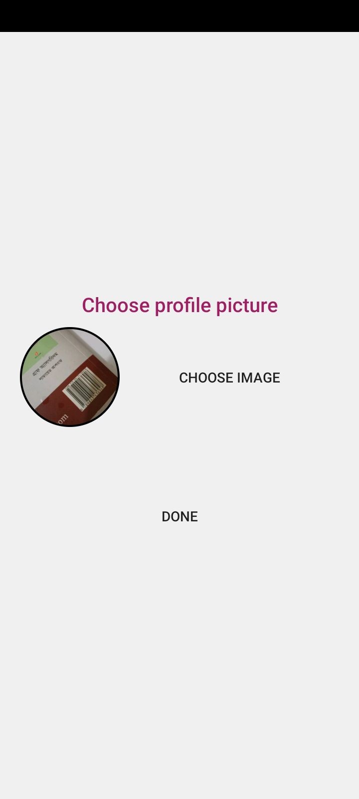
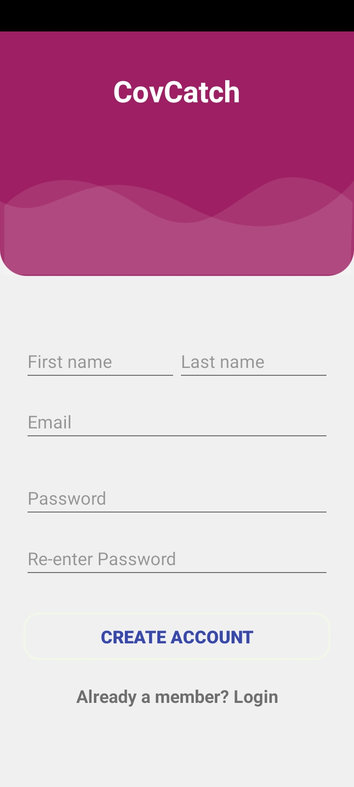

### Covid 19 contact tracing using Bluetooth Low Energy
In this project, we are trying to get potential covid 19 patients using contract tracing of already covid 19 affected people.
- Keep track of nearby users using Bluetooth Low
Energy technology.
- If any nearby user report positive, it will warn others nearby
users to do Covid-19 test as soon as possible.
- Statistics of Covid-19 worldwide and country wise using
API
- User will turn on isolation mode if he/she tested positive.
- User will turn on covid guard if he/she want to get warning was there any Covid positive people around him.

# Screenshots

### If you do not come contact with any Covid 19 positive people.

### If you come into contact with Covid-19 positive people.

## Homepage(Isolation Mode and Covid guard is on)

### Global Covid 19 statistics also displayed in homepage.

## Others Screenshorts

## Isolation days count

### Country wise Covid statistics

## Profile and Profile Settings/Update

### Changing Display Picture

### Requesting for password reset link via email

### Login/Register

### Update display image or name

### Welcome Pages

